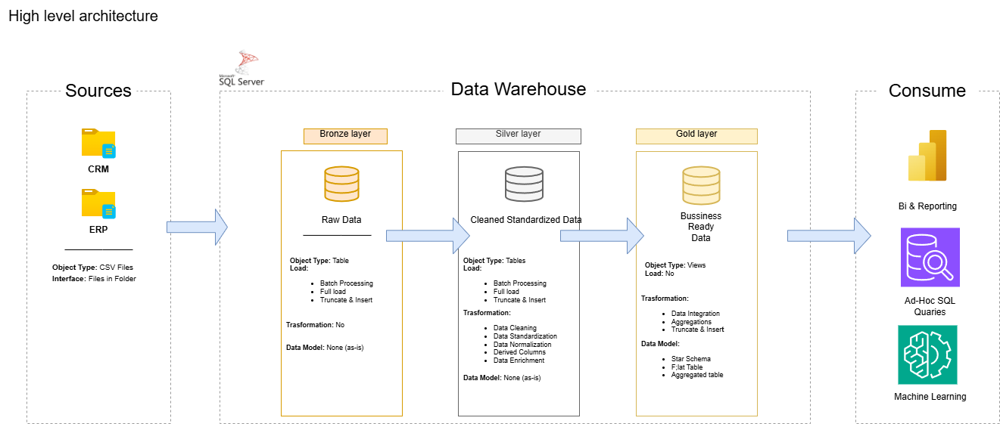

# Data Warehouse Project

Hi! 👋  
Welcome to my **Data Warehouse Project** repository.  
This project is part of my journey to deepen my skills in data engineering and analytics.  
From building a modern data warehouse to creating meaningful insights, this project showcases my ability to handle data across the full pipeline—from raw ingestion to reporting.

---

## 🏗️ Data Architecture

I designed the data architecture based on the **Medallion Architecture** — which separates data into **Bronze**, **Silver**, and **Gold** layers for clarity, quality, and performance:



- **Bronze Layer**: Raw data ingestion from ERP and CRM CSV files into SQL Server.
- **Silver Layer**: Cleaned and standardized data, prepped for analytics.
- **Gold Layer**: Final business-ready tables modeled into a star schema, optimized for BI and reporting.

---

## 📖 Project Overview

Here’s what I did in this project:

1. **Architected the Data Pipeline** using Medallion Layering  
2. **Built ETL Pipelines** to extract, transform, and load data from flat files to a SQL Server database  
3. **Designed a Star Schema** with fact and dimension tables  
4. **Created SQL-based Analytics and Dashboards** to generate actionable insights  

This project helped me strengthen my practical knowledge in:

- SQL Development  
- Data Warehousing  
- ETL and Data Pipeline Design  
- Data Modeling  
- Data Analytics and Reporting  

---

## 🛠️ Tools & Resources I Used

All tools and resources in this project are free and open source:

- **[Datasets](datasets/)**: Source data in CSV format  
- **[SQL Server Express](https://www.microsoft.com/en-us/sql-server/sql-server-downloads)**  
- **[SQL Server Management Studio (SSMS)](https://learn.microsoft.com/en-us/sql/ssms/download-sql-server-management-studio-ssms?view=sql-server-ver16)**  
- **[DrawIO](https://www.drawio.com/)**: For designing architecture and data flow diagrams  
- **[Notion Project Template](https://www.notion.com/templates/sql-data-warehouse-project)**  
- **[Notion Project Steps](https://thankful-pangolin-2ca.notion.site/SQL-Data-Warehouse-Project-16ed041640ef80489667cfe2f380b269?pvs=4)**  
- **Git & GitHub**: For version control and collaboration  

---

## 🚀 Project Goals & Requirements

### 1. Data Engineering – Building the Data Warehouse

**Goal**: Consolidate data from multiple systems into a clean, scalable SQL Server warehouse.

**Key Tasks**:
- Import ERP and CRM data from CSV files  
- Cleanse and standardize data  
- Resolve duplicates and quality issues  
- Integrate everything into a unified, analytics-friendly model  
- Focused on the most recent data only (no historical tracking)  

---

### 2. Data Analysis – BI & Reporting

**Goal**: Use SQL to extract insights that help drive business decisions.

**Key Insights Generated**:
- Customer purchase patterns and segmentation  
- Product performance analysis  
- Sales trends over time  


---

## 📂 Repository Structure
```
data-warehouse-project/
│
├── datasets/                           # Raw datasets used for the project (ERP and CRM data)
│
├── docs/                               # Project documentation and architecture details
│   ├── etl.drawio                      # Draw.io file shows all different techniquies and methods of ETL
│   ├── data_architecture.drawio        # Draw.io file shows the project's architecture
│   ├── data_catalog.md                 # Catalog of datasets, including field descriptions and metadata
│   ├── data_flow.drawio                # Draw.io file for the data flow diagram
│   ├── data_models.drawio              # Draw.io file for data models (star schema)
│   ├── naming-conventions.md           # Consistent naming guidelines for tables, columns, and files
│
├── scripts/                            # SQL scripts for ETL and transformations
│   ├── bronze/                         # Scripts for extracting and loading raw data
│   ├── silver/                         # Scripts for cleaning and transforming data
│   ├── gold/                           # Scripts for creating analytical models
│
├── tests/                              # Test scripts and quality files
│
├── README.md                           # Project overview and instructions
├── LICENSE                             # License information for the repository
├── .gitignore                          # Files and directories to be ignored by Git
└── requirements.txt                    # Dependencies and requirements for the project
```


---

## 📧 Contact Me

- **GitHub**: [https://github.com/Firas-Faisal](https://github.com/Firas-Faisal)  
- **LinkedIn**: [https://linkedin.com/in/ahmad-firas04](https://linkedin.com/in/ahmad-firas04)  
- **Portfolio**: [https://firas-faisal.github.io/](https://firas-faisal.github.io/)  
- **Email**: ahmadfiras.faisal@gmail.com
